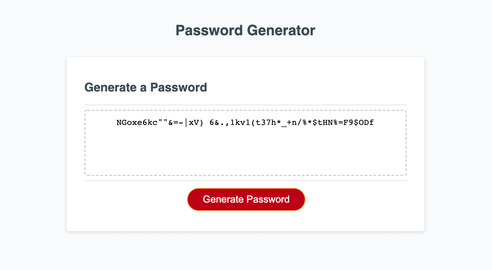

# Password-Generator
An application to generate a random password based on the criteria that has been selected.

This password generator gives the user the option to include lower and uppercase alphanumeric characters as well as symbols by multiple prompts.
The password is then generated into a text box on screen and includes at least one of each type of character that the user has selected.

# Password Generator URL:
Navigate to: https://marissakrantz.github.io/password-generator/

# Screenshot of Password Generator

